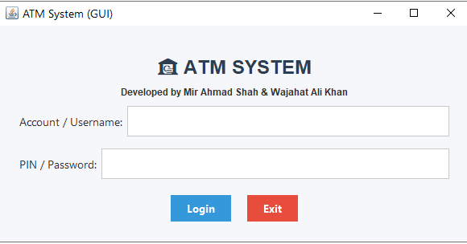
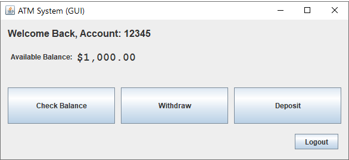
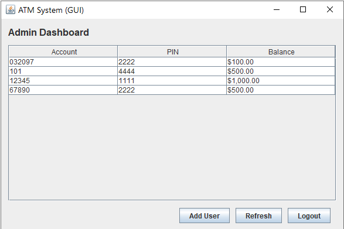

# 💳 ATM (Automated Teller Machine)

A simple **ATM** simulation program written in **Java**, designed to demonstrate key programming concepts such as **OOP (Object-Oriented Programming)**, **encapsulation**, **Programming Fundamentals**, and **user interaction** through a **console-based interface**.

---

## Output Screenshots

<p align="center">
  
  
  
</p>

---

## 🧠 Project Overview

The **ATM** project allows users to perform essential banking operations, including:

- 🔑 User authentication using account numbers and PINs  
- 💰 Balance inquiry  
- 💵 Cash withdrawal  
- 💳 Cash deposit  
- 🔁 Account management through a secure and interactive console menu  

The system uses **Java Collections (HashMap & Map)** to store and manage multiple user accounts efficiently.

---

## 🧩 Key Concepts Demonstrated

| Concept | Description |
|----------|-------------|
| **Classes & Objects** | Encapsulate account data and ATM logic into structured classes. |
| **Encapsulation** | Sensitive account data (PINs, balances) is private and accessed via methods. |
| **HashMap & Map Interface** | Store and retrieve bank accounts efficiently using account numbers as keys. |
| **Control Flow** | Manage user input and ATM menu operations with conditionals and loops. |
| **Exception Handling** | Handle invalid inputs gracefully using try-catch blocks. |
| **File Handling** | Performing operations such as creating, reading and writing files and directories. |

---

## 🗂️ Project Structure

```

ATM/
│
├── src/
│ ├── BankAccount.java # Represents individual bank accounts
│ ├── ATM.java # Entry point to start the program
│ └── Functionalities.java # Main class handling user interface and operations
│
└── README.md # Project documentation (this file)

```

---

## ⚙️ How It Works

1. The program starts and displays a login prompt.
2. The user enters their **account number** and **PIN**.
3. Check Authorization of account and PIN.
4. After successful login, a menu appears with available operations:
   - Check Balance
   - Deposit Money
   - Withdraw Money
   - Exit
5. The program validates transactions (e.g., sufficient funds for withdrawals).
6. All changes are updated in real time for that session.

---


## 🧱 Technologies Used

- **Java SE 8+**
- **HashMap & Map Collections Framework**
- **OOP Principles**
- **Exception Handling and File Handling**
- **Scanner (for console input)**

---

## 🕒 Project Timeline

| 📅 Week | 🧩 Task Description | 📆 Date |
|:--------:|:--------------------|:--------:|
| **Week 7 – Week 8** | Developed a **console-based ATM** application in Java, implementing core banking operations like deposit, withdraw, and balance inquiry. | — |
| **Week 9** | 🧠 **Mid-Term Exam** — paused project development for assessments. | 🗓️ *24-10-2025* |
| **Week 10** | Integrated a **basic GUI-based ATM** in Java using Swing to enhance user interaction and experience. | 🗓️ *31-10-2025* |

---

### 🏗️ Progress Overview
✅ Console Version Completed  
🟡 GUI Integration In Progress  


